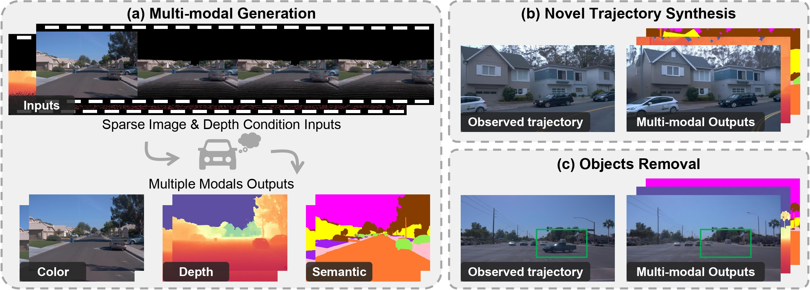

<div align="center">

___<font size="6">***MuDG: Taming Multi-modal Diffusion with Gaussian Splatting for Urban Scene Reconstruction***</font>___
<br>
<br>
<a href='https://arxiv.org/pdf/2503.10604'></a>
&nbsp;
<a href='https://heiheishuang.xyz/mudg'></a>
&nbsp;

_**[Yingshuang Zou](https://heiheishuang.xyz), [Yikang Ding](https://scholar.google.com/citations?hl=zh-CN&user=gdP9StQAAAAJ), [Chuanrui Zhang](https://xingyoujun.github.io/), [Jiazhe Guo](https://scholar.google.com/citations?hl=zh-CN&user=pWLqZnoAAAAJ), [Bohan Li](https://scholar.google.com/citations?hl=zh-CN&user=V-YdQiAAAAAJ), <br>[Xiaoyang Lyu](https://shawlyu.github.io/), [Feiyang Tan](https://scholar.google.com/citations?hl=zh-CN&user=KeiZBdMAAAAJ), [Xiaojuan Qi](https://scholar.google.com/citations?hl=zh-CN&user=bGn0uacAAAAJ), [Haoqian Wang](https://scholar.google.com/citations?user=eldgnIYAAAAJ&hl=zh-CN)**_
<br><br>
</div>


 
## 🔆 News
🔥🔥 (2025.03) The **training** and **inference** code of Multi-modal Diffusion is available **NOW**!!!

🔥🔥 (2025.03) Paper in on arXiv: [MuDG: Taming Multi-modal Diffusion with Gaussian Splatting for Urban Scene Reconstruction](https://arxiv.org/pdf/2503.10604)

## 📝 TODO List
- [ ] Release data processing code.
- [x] Release training / inference code.

## 👀 Abstract
Recent breakthroughs in radiance fields have significantly advanced 3D scene reconstruction and novel view synthesis (NVS) in autonomous driving. Nevertheless, critical limitations persist: reconstruction-based methods exhibit substantial performance deterioration under significant viewpoint deviations from training trajectories, while generation-based techniques struggle with temporal coherence and precise scene controllability. To overcome these challenges, we present MuDG, an innovative framework that integrates Multi-modal Diffusion model with Gaussian Splatting (GS) for Urban Scene Reconstruction. MuDG leverages aggregated LiDAR point clouds with RGB and geometric priors to condition a multi-modal video diffusion model, synthesizing photorealistic RGB, depth, and semantic outputs for novel viewpoints. This synthesis pipeline enables feed-forward NVS without computationally intensive per-scene optimization, providing comprehensive supervision signals to refine 3DGS representations for rendering robustness enhancement under extreme viewpoint changes. Experiments on the Open Waymo Dataset demonstrate that MuDG outperforms existing methods in both reconstruction and synthesis quality.


## 🧰 Models

| Model      |Resolution| Checkpoint                                                                         |
|:-----------|:---------|:-----------------------------------------------------------------------------------|
| MDM1024    |576x1024| [Hugging Face](https://huggingface.co/heiheishuang/MuDG_1024/blob/main/1024-mdm-checkpoint.ckpt) |
| MDM512     |320x512| [Hugging Face](https://huggingface.co/heiheishuang/MuDG_512/blob/main/512-mdm-checkpoint.ckpt)  |

## ⚙️ Setup

### Install Environment via Anaconda (Recommended)
```bash
conda create -n mudg python=3.8.5
conda activate mudg
pip install -r requirements.txt
```


### 💫 Inference for Novel View Viewpoint
#### 1. Sparse Conditional Generation
We project the fused  point clouds to novel viewpoints, yielding sparse color and depth maps. 
```bash
TODO
```
We provided the processed data in this [link](https://huggingface.co/datasets/heiheishuang/MuDG_waymo_example/).

#### 2. Generate item list
```bash
python virtual_render/generate_virtual_item.py
```

#### 3. Multi-modal Diffusion
1) Download pretrained models, and put the `model.ckpt` with the required resolution in `checkpoints/[1024|512]_mdm/[1024|512]-mdm-checkpoint.ckpt`.
2) Run the commands based on your devices and needs in terminal.
```bash
  sh virtual_render/scripts/render.sh 15365
```
15365 is the item id, and you can change it to any item id following the item list.


## 💥 Training
### Novel View Generation
1. Process the data and generate the item list.
2. Generate the train data list:
```bash
python data/create_data_infos.py
```
3. Download the pretrained model [DynamiCrafter512](https://github.com/Doubiiu/DynamiCrafter) and put the `model.ckpt` in `checkpoints/512_mdm/512-mdm-checkpoint.ckpt`.
3. We train the 320 * 512 model with the following command:
```bash
  sh configs/stage1-512_mdm_waymo/run-512.sh
```
4. Then we use the following command to train the 576 * 1024 model:
```bash
  sh configs/stage2-1024_mdm_waymo/run-1024.sh
```


## 📜 License
This repository is released under the Apache 2.0 license.


## 😉 Citation
Please consider citing our paper if our code are useful:
```bib
@article{zou2025mudg,
  title={MuDG: Taming Multi-modal Diffusion with Gaussian Splatting for Urban Scene Reconstruction},
  author={Zou, Yingshuang and Ding, Yikang and Zhang, Chuanrui and Guo, Jiazhe and Li, Bohan and Lyu, Xiaoyang and Tan, Feiyang and Qi, Xiaojuan and Wang, Haoqian},
  journal={arXiv preprint arXiv:2503.10604},
  year={2025}
}
```


## 🙏 Acknowledgements
We would like to thank the contributors of the following repositories for their valuable contributions to the community:
- [DynamiCrafter](https://github.com/Doubiiu/DynamiCrafter/tree/main)
- [SegFormer](https://github.com/NVlabs/SegFormer?tab=readme-ov-file)
- [DepthLab](https://github.com/ant-research/DepthLab/tree/main)
- [StreetGaussians](https://github.com/zju3dv/street_gaussians)
